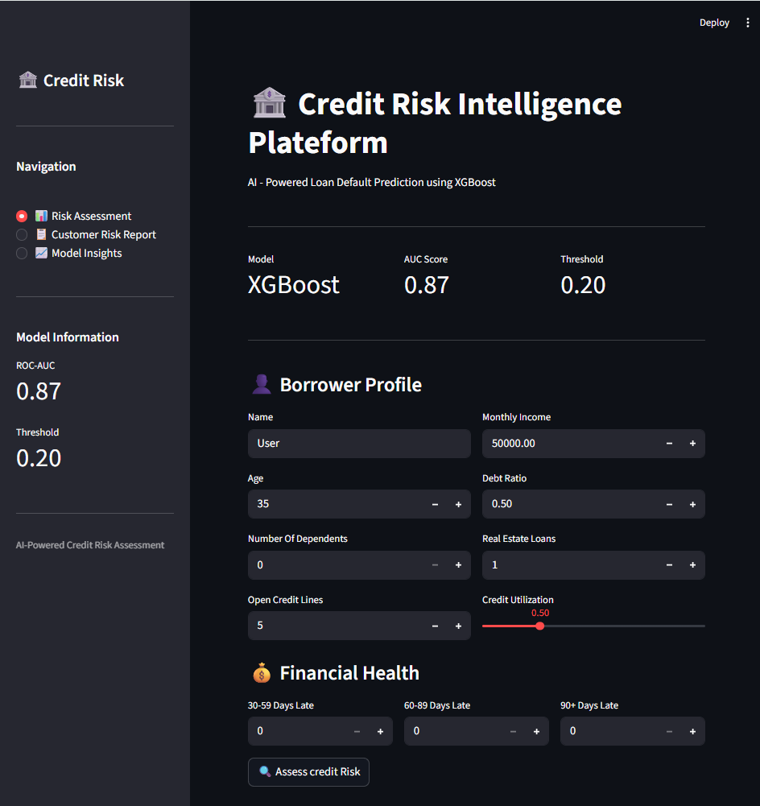
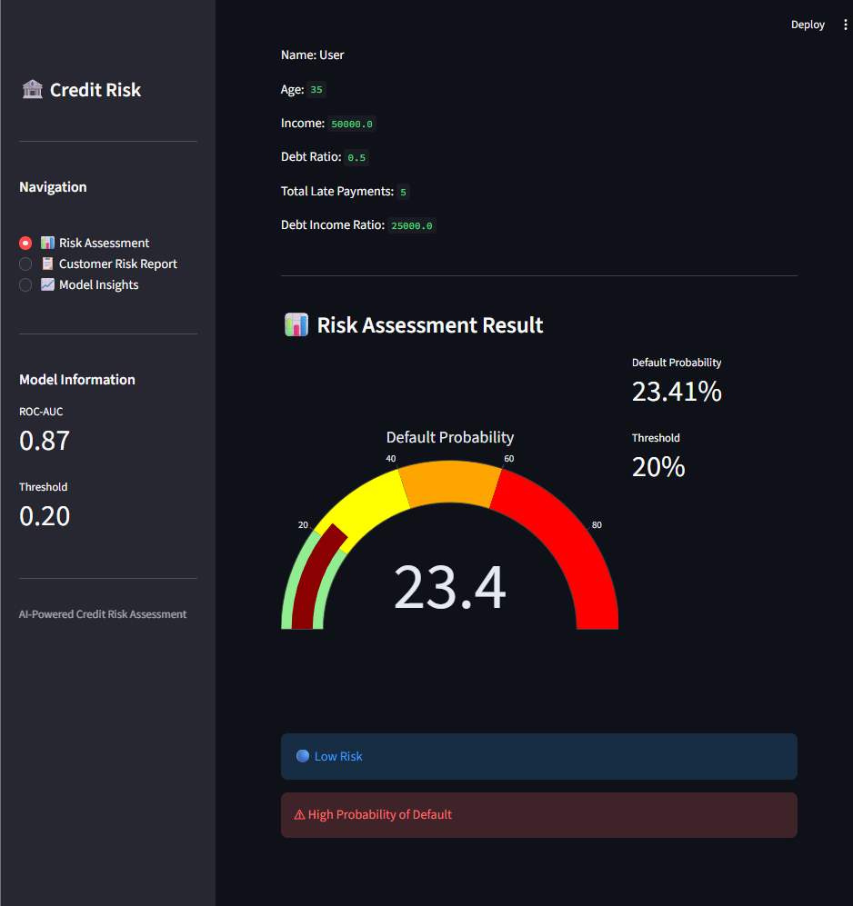

# 🏦 Credit Risk Intelligence Platform

### AI-Powered Loan Default Prediction using XGBoost & Streamlit

An end-to-end Machine Learning application that predicts the probability of customer loan default and generates business-oriented risk assessment reports to support lending decisions.

---

## 📌 Project Overview

Financial institutions face significant losses due to loan defaults. The objective of this project is to build an intelligent credit risk assessment system capable of identifying high-risk borrowers before loan approval.

This platform:

- Predicts customer default probability
- Classifies borrowers into risk categories
- Generates customer-specific risk reports
- Provides business recommendations
- Visualizes risk insights through an interactive dashboard

---

## 🚀 Live Demo

[Credit Risk Intelligence Plateform](https://credit-risk-intelligence-platform-b83k4j8rymjgm8aljsjifn.streamlit.app/)

---

## 📊 Problem Statement

Given a customer's financial and repayment history, predict whether the customer is likely to default on a loan.

Target Variable:

```text
SeriousDlqin2yrs

1 → Defaulter
0 → Non-Defaulter
```

---

## 📂 Dataset

Dataset Used:

**Give Me Some Credit Dataset**

The dataset contains borrower information such as:

- Age
- Monthly Income
- Debt Ratio
- Credit Utilization
- Open Credit Lines
- Real Estate Loans
- Historical Late Payments
- Number of Dependents

The dataset is not included in this repository due to licensing and repository size considerations.

---

## ⚙️ Feature Engineering

Additional business-oriented features were created:

### DebtIncomeRatio

```text
DebtRatio × MonthlyIncome
```

Measures the customer's debt burden relative to income.

### TotalLatePayments

```text
30-59 Late Payments
+
60-89 Late Payments
+
90+ Late Payments
```

Captures overall delinquency behaviour.

---

## 🤖 Models Evaluated

### Logistic Regression

Used as a baseline model.

### XGBoost Classifier

Selected as the final model due to:

- Better handling of non-linear relationships
- Higher predictive performance
- Stronger generalization capability

---

## 📈 Model Performance

| Metric | Value |
|----------|----------|
| ROC-AUC | 0.87 |
| Model | XGBoost |
| Decision Threshold | 0.20 |

### Threshold Optimization

Instead of using the default threshold of 0.50, the decision threshold was optimized to 0.20 to improve recall and identify a larger proportion of potential defaulters.

This approach aligns better with real-world lending scenarios where missing a defaulter is more costly than flagging a few additional customers for review.

---

## 🛠️ Tech Stack

### Programming

- Python

### Data Analysis

- Pandas
- NumPy

### Machine Learning

- Scikit-Learn
- XGBoost

### Explainability

- SHAP

### Visualization

- Matplotlib
- Plotly

### Deployment

- Streamlit

### Version Control

- Git
- GitHub

---

## 🖥️ Application Features

### Risk Assessment Dashboard

- Customer Information Input
- Financial Health Metrics
- Real-Time Prediction
- Risk Probability Gauge

### Customer Risk Analysis Report

- Executive Summary
- Risk Classification
- Key Risk Drivers
- Business Recommendation

### Model Insights

- Feature Importance
- SHAP Explainability
- Model Performance Overview

---

## 📸 Application Screenshots

### Home Page



---

### Risk Prediction



---

## 📁 Project Structure

```text
Credit-Risk-Intelligence-Platform/

├── app.py
├── README.md
├── requirements.txt
├── .gitignore
│
├── models/
│   ├── loan_default_xgb.pkl
│   └── scaler.pkl
│
├── notebooks/
│   └── model.ipynb
│
├── assets/
│   ├── feature_importance.png
│   └── shap_summary.png
│
├── data/
│   └── Dataset.txt
│
└── screenshots/
```

---

## 🔮 Future Improvements

- PDF Risk Reports
- Dynamic Threshold Adjustment
- Database Integration
- User Authentication
- Portfolio Analytics Dashboard
- Cloud Deployment Enhancements

---

## 🎯 Key Learnings

Through this project I gained hands-on experience with:

- Exploratory Data Analysis (EDA)
- Data Cleaning & Preprocessing
- Feature Engineering
- Classification Models
- ROC-AUC Evaluation
- Threshold Optimization
- Explainable AI (SHAP)
- Streamlit Application Development
- Git & GitHub Workflow
- End-to-End Machine Learning Deployment

---

## 👨‍💻 Author

**Roshan Deep Sharma**

Production & Industrial Engineering  
MNNIT Allahabad

Interested in:

- Data Science
- Machine Learning
- Analytics
- AI-Powered Business Solutions

---
⭐ If you found this project interesting, feel free to star the repository.